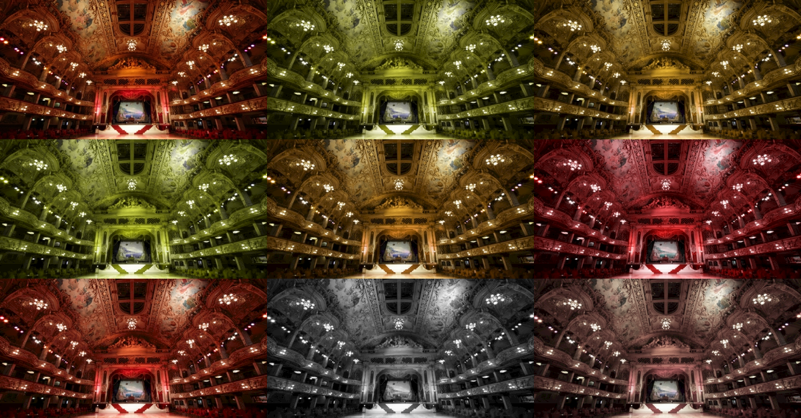

# Color Deficiency Snapshot Tests

This package makes it easier for you to understand the implications of your app's design on users with various types of color blindness.

It adds functionality to [SnapshotTesting](https://github.com/pointfreeco/swift-snapshot-testing/) which allows you to generate images of your UIViews, UIViewControllers and UIImages with multiple color blindness filters over the top simulating what it looks like to users with different types of vision deficiencies.



## Usage

```swift
// 1. Import
import AccessibilitySnapshotColorBlindness

// 2. Create UIView, UIViewController or UIImage.
let systemUnderTest = // ... your code

// 3. Assert Snapshot
assertSnapshot(matching: image, as: .image_colourBlindness(type: .protanopia))
```

You may wish to use `MatrixTypes.allCases` to snapshot all variations of your view. You can see an example of this in our tests.

## Shoutouts

* The filters used by this package originated in [this repository](https://github.com/hail2u/color-blindness-emulation) by Kyo Nagashima.
* This project was inspired by [AccessibilitySnapshot](https://github.com/cashapp/AccessibilitySnapshot).
* This project wouldn't have been possible without [SnapshotTesting](https://github.com/pointfreeco/swift-snapshot-testing/).
